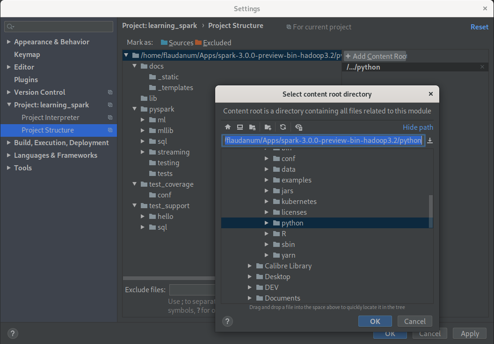

<table style="border-style: none;">
    <tr >
        <td>
            
        </td>
        <td>
            <span style="font-weight: 500; font-size: 2em;">Apache Spark</span>
        </td>
    </tr>
</table>

# Setup

## Specify a Python interpreter

The default interpreter is Python 2.7.x. Edit file `$SPARK_HOME/conf/spark-env.sh` (create it from the template if necessary) and set the environment variable `PYSPARK_PYTHON`.

<i style="color:#909090;">In file conf/spark-env.sh:</i>
```bash
export PYSPARK_PYTHON=python3
```
Now `pyspark` and `spark-submit` use `python3` interpreter. However directly running a script whith `import pypspark` with the python interpreter instead of using spark-submit will fail. It also requires to export `PYSPARK_PYTHON` in `.bashrc` or `.bash_profile`.

<i style="color:#909090;">In file .bashrc or .bash_profile:</i>
```bash
export PYSPARK_PYTHON=python3
```


## Running pyspark with ipython

For Spark version >= 2.0 set `PYSPARK_DRIVER_PYTHON`:
```
$ PYSPARK_DRIVER_PYTHON=ipython pyspark
```
This setting can be made permanent by editing file `$SPARK_HOME/conf/spark-env.sh`:
```bash
export PYSPARK_DRIVER_PYTHON=ipython pyspark
```

## Configure PyCharm for PySpark

In *PyCharm*'s menu go to **File>Settings>Project>Project Structure** and push button **Add Content Root**.



This may require to install packages `py4j` and `pypandoc`
```
$ python3 -m pip install py4j pypandoc
```

When using *python3*, *PyCharm* must be started from the terminal and the environment variable `PYSPARK_PYTHON` must be set in the environment of this terminal.

# APIs

## Spark python API

The Spark's python API reference is available at [https://spark.apache.org/docs/latest/api/python/index.html](https://spark.apache.org/docs/latest/api/python/index.html).


# Troubleshooting

## Warnings at runtime

### WARN NativeCodeLoader: Unable to load native-hadoop library for your platform... using builtin-java classes where applicable

**Solution**

Of course *Hadoop* must be installed. Set environment variable `HADOOP_HOME` to the root of the *Hadoop* install path. Add *Hadoop* libraries' path to the environment variable `LD_LIBRARY_PATH`.

<i style="color:#909090;">In file .bashrc or .bash_profile:</i>

```bash
export HADOOP_HOME=$APPS/hadoop-3.2.0
export LD_LIBRARY_PATH=$LD_LIBRARY_PATH:$HADOOP_HOME/lib/native
```

## Fatal errors

### java.lang.OutOfMemoryError: Java heap space

For instance when running pyspark, the following exception is raised:
```
py4j.protocol.Py4JJavaError: An error occurred while calling z:org.apache.spark.api.python.PythonRDD.readRDDFromFile.
: java.lang.OutOfMemoryError: Java heap space
```
The JVM lacked of memory. The heap size of the JVM can be extended with option `-Xmx<memory size>` of command `java`. However, this can be fixed with Spark the option `spark.driver.memory` which defaults to `'1g'`. Spark options can be set with accessors of the `SparkConf` instance.

*PySpark example*
```python
conf = SparkConf().setMaster('local[12]').setAppName('My Spark App')
conf.set('spark.driver.memory', '2g')
```
